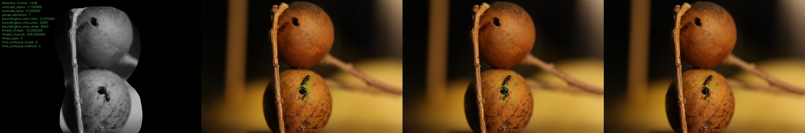

# DatasetGenerator

A small Xcode project to extract test images with bounding box annotations from video clips – to prepare training data for object detection.

---

## Description

This project automatically extracts single frames from a video clip, along with annotation files containing bounding boxes for detected objects. The output can later be used to train a YOLO model or for further annotation.

### Example

Below is a frame taken from a video clip where two objects (ants) were detected and marked with bounding boxes:

<div align="center">
<br/>

<div align="center">
    A frame where two objects were detected
</div>
</div>

<div align="center">
<br/>

<div align="center">
    Overview of relevant processing steps for debugging and fine-tuning parameters
</div>
</div>

and the annotation (see [docs/annotation.txt](./docs/annotation.txt)):

```
0 0.534668 0.701471 0.0498047 0.138235
0 0.52002 0.608088 0.0771484 0.0897059
```

---

## Setup

```bash
git clone https://github.com/simas2024/Dataset.git
cd DatasetGenerator
brew install opencv nlohmann-json
```

For running the XCTest load the clip file via Git LFS:

```bash
git lfs pull
```

> Note: OpenCV 4.x is used (installed via Homebrew)  
> Include and library paths are managed via `.xcconfig` – no manual setup needed.

---

## Using the Xcode Project

### Open
- Open `Dataset.xcodeproj` in Xcode

### Build
- All necessary settings are preconfigured
- Just press `⌘B`

### Test
- Select the **`Dataset`** target
- Press `⌘U` to run the XCTest

### Run

_TODO_  

---

## Customizing

_TODO_  